# 💳 Detección de Fraude con Machine Learning

<p align="center">
  
</p>


Este proyecto aplica técnicas de **aprendizaje automático supervisado** para detectar transacciones fraudulentas en tarjetas de crédito. El objetivo es construir un modelo eficaz que logre **identificar el fraude** minimizando los falsos negativos, en un contexto de **datos altamente desbalanceados**.

---

## 📊 Dataset

- Dataset: [Credit Card Fraud Detection Dataset - Kaggle](https://www.kaggle.com/datasets/mlg-ulb/creditcardfraud)
- Observaciones: 284.807 transacciones
- Clases:
  - `0`: No fraude
  - `1`: Fraude (solo 0.17% del total)
- Variables: 30 (mayoría anonimizadas con PCA, más `Time` y `Amount`)

---

## 🧠 Técnicas Utilizadas

- Exploración y limpieza de datos
- Submuestreo para balancear clases
- Visualizaciones con Seaborn y Matplotlib
- Entrenamiento con múltiples modelos:
  - Regresión Logística
  - Árbol de Decisión
  - Random Forest
  - XGBoost
- Optimización de hiperparámetros con `GridSearchCV`
- Creación de Pipelines con `sklearn.pipeline`
- Interpretabilidad con `SHAP`
- Evaluación en conjunto de prueba no balanceado

---

## ⚙️ Tecnologías

- Python 3.x
- Jupyter Notebook
- Pandas, Numpy
- Scikit-learn
- XGBoost
- Matplotlib, Seaborn
- SHAP

---

## 📈 Resultados

| Modelo               | F1-score (fraude) | ROC AUC  | Accuracy | Recall (fraude) |
|---------------------|------------------:|---------:|---------:|----------------:|
| **Random Forest**    | **0.0981**         | **0.9708** | 97.30%   | 0.8803          |
| XGBoost             | 0.0705            | 0.9707   | 96.13%   | 0.8803          |
| Regresión Logística | 0.0664            | 0.9630   | 95.87%   | 0.8803          |
| Árbol de Decisión   | 0.0343            | 0.9083   | 91.52%   | **0.9014**      |

> 🔎 **Conclusión**: Todos los modelos lograron un buen recall para la clase fraudulenta, pero **Random Forest** fue el más equilibrado y eficaz en términos de F1-score. XGBoost también mostró gran desempeño. La combinación de balanceo, pipeline y validación cruzada fue clave.

---

## 📷 Visualizaciones

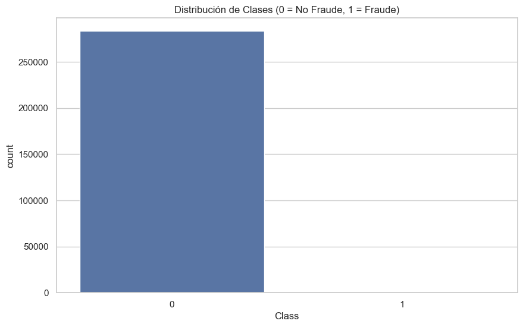
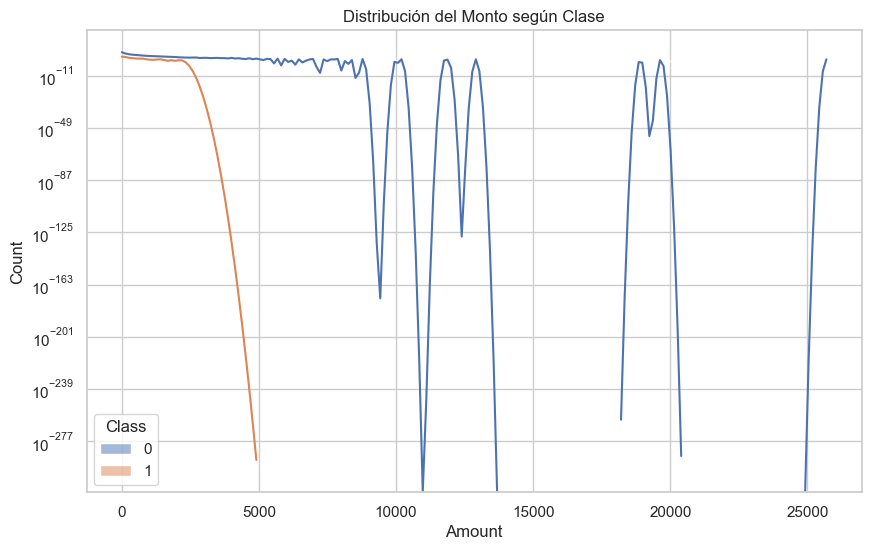
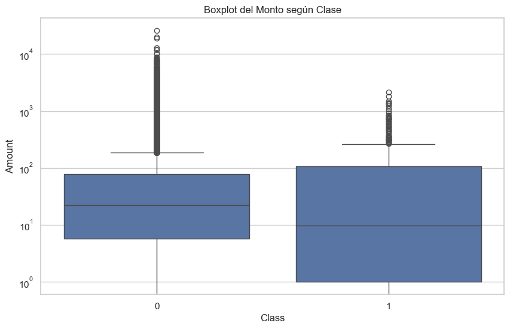
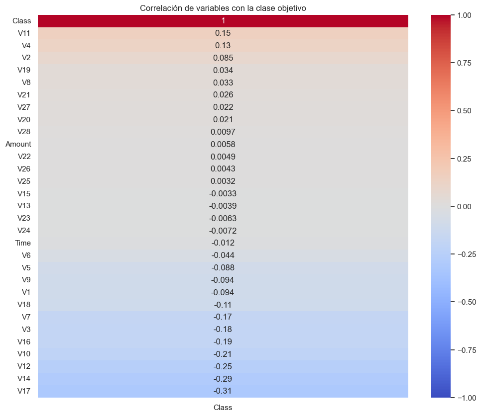
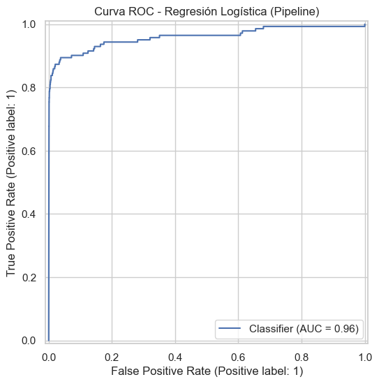
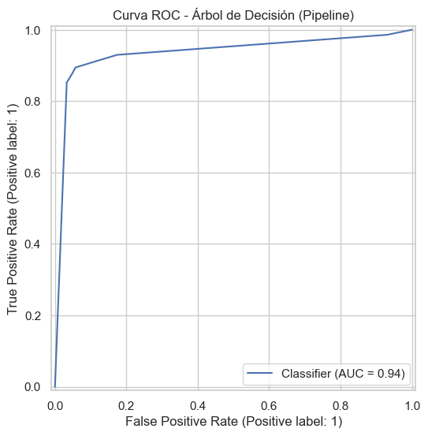
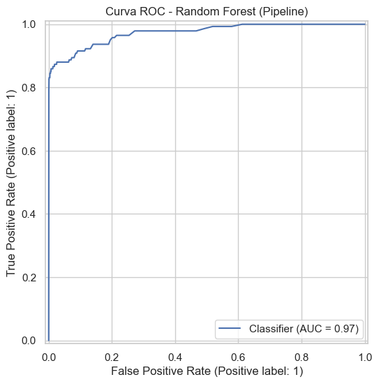
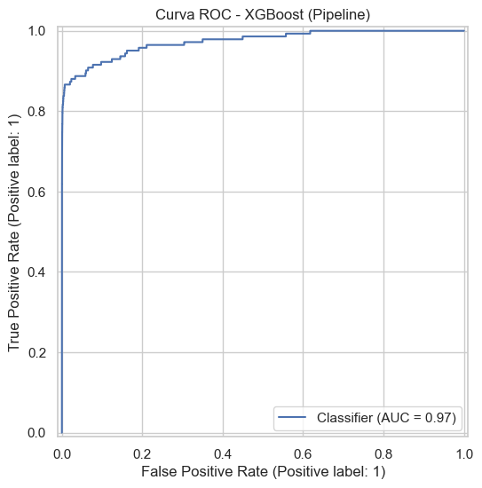

---

## 🧠 Interpretabilidad (SHAP)

Se utilizó la librería **SHAP** para explicar el modelo de XGBoost, identificando las variables que más contribuyen a detectar fraudes.

🔹 Importancia media de variables (SHAP)

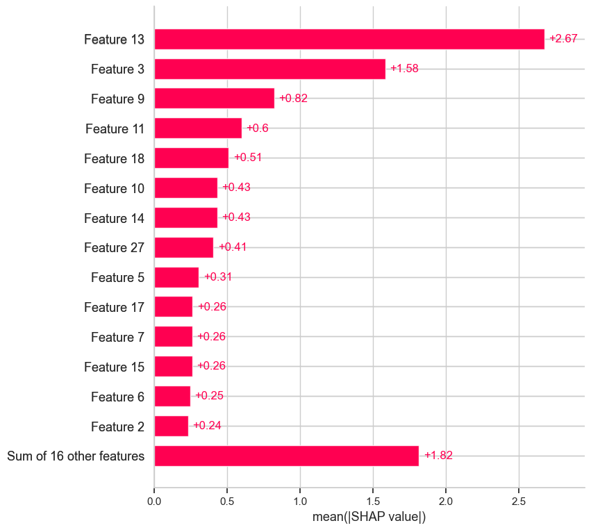

🔹 Distribución del impacto de las variables

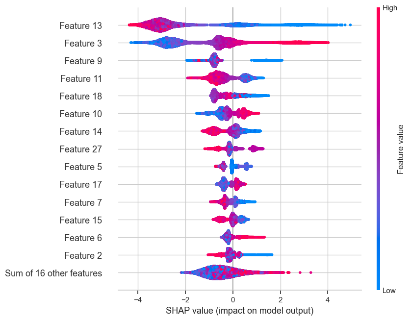

🔹 Explicación de una predicción individual

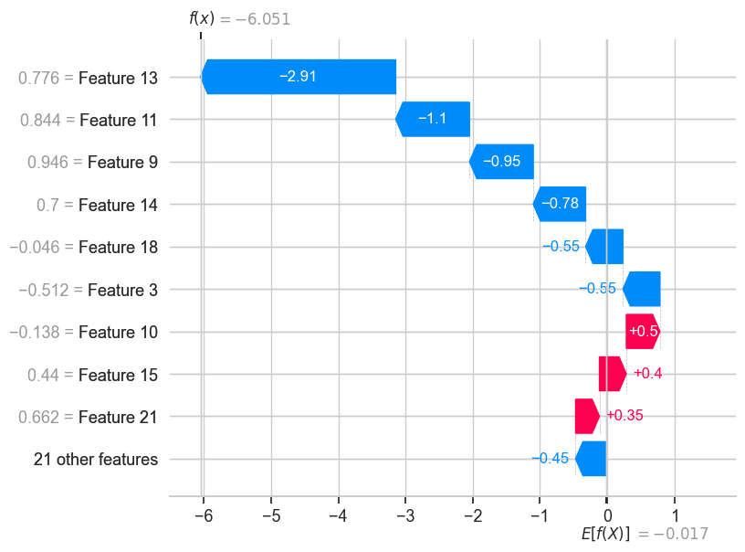

---

## 📁 Estructura del Repositorio

```markdown
fraude-tarjeta/
├── fraude-tarjeta.ipynb         # Notebook con el proyecto completo
├── README.md                    # Este archivo
├── requeriments.txt             # Librerías necesarias
└── /images                      # Gráficos de EDA y resultados
´´´

🔗 Proyecto realizado por [Matías Vallone](https://github.com/ValloneMatias)
